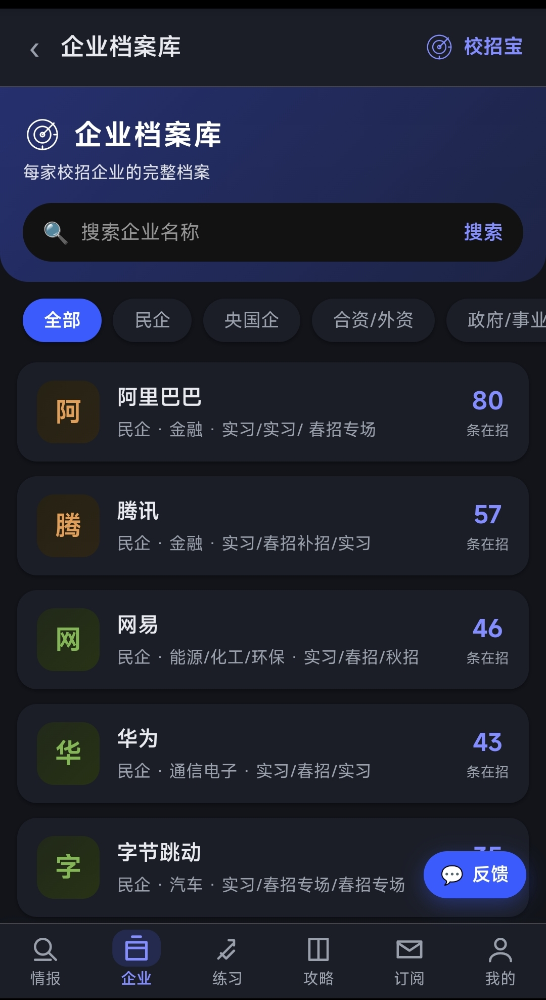
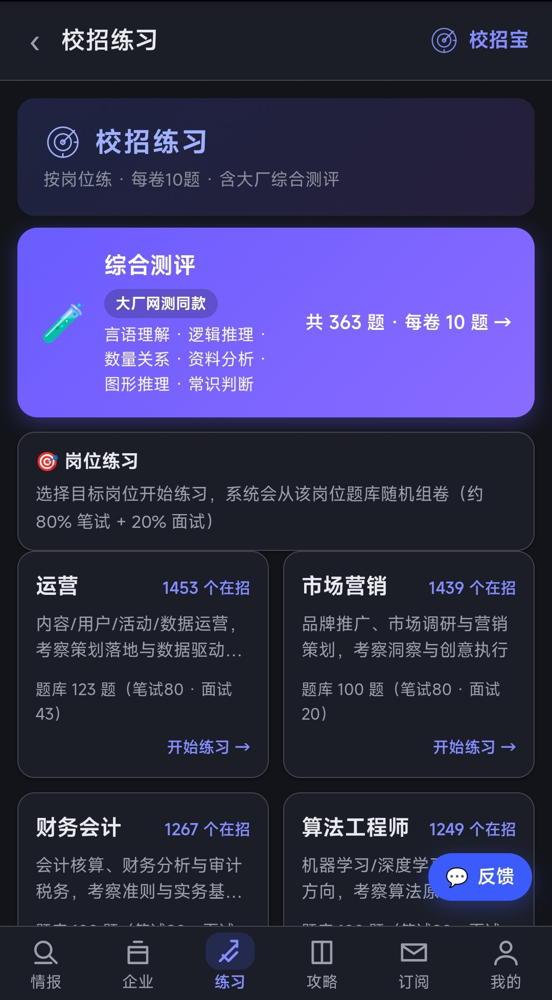
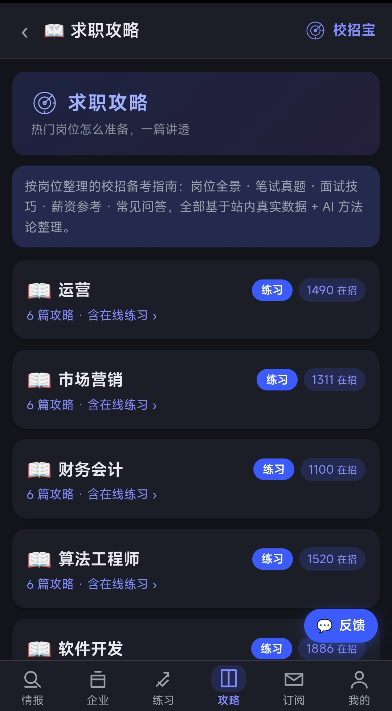
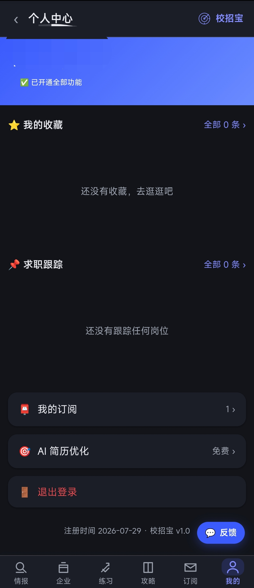

## 截图预览

| 首页情报 | 企业档案库 | 校招练习 |
| :---: | :---: | :---: |
|  |  |  |
| 求职攻略 | 个人中心 | |
|  |  | |

---

# 🎯 recruit-hub · 校招宝开源版

**零依赖的校园招聘信息聚合站** —— `git clone` 一条命令即可跑起来，无需 npm install、无需构建、无需数据库服务。

> 校招宝是面向应届生的校招情报站：岗位检索、企业档案、求职攻略、岗位练习、薪资参考。本仓库是它的**开源版**，演示数据完全脱敏；线上运营实例独立于本仓库。


---

## ✨ 特性

| 能力 | 说明 |
|---|---|
| 🚀 **零依赖** | Node 22 原生 `node:sqlite`，无任何第三方包 |
| 📱 **SSR + SPA** | 搜索引擎可见（sitemap / llms.txt / JSON-LD / PWA），前后端一体 |
| 🔍 **精准筛选** | 按公司 / 岗位 / 城市 / 学历 / 届别 / 批次 / 行业 / 笔试情况 |
| 🏢 **企业档案** | 按母公司聚合全部在招岗位与笔面经 |
| 📖 **求职攻略** | 按岗位的笔试 / 面试 / 薪资备考指南 |
| ✏️ **岗位练习** | 在线作答、自动判分 |
| 💰 **薪资参考** | 薪资区间与真实爆料聚合 |
| 🔑 **账号体系** | 邮箱注册 / 密码登录 / 收藏 / 订阅提醒 |
| 🛡 **安全** | 管理后台鉴权、安全响应头、防爆破、合规页 |

## 🚀 一键体验（30 秒跑起来）

要求：**Node.js ≥ 22.5**（Node 22 自带 `node:sqlite`，无需任何安装步骤）。

```bash
git clone https://github.com/kknee-dev/recruit-hub.git
cd recruit-hub
# Linux / macOS
./start.sh
# Windows
start.bat
```

打开 `http://localhost:3600` —— 已自动加载 60 条脱敏演示岗位 + 20 家企业档案。

**或者用 GitHub Codespaces**：打开仓库 → Code → Codespaces → 创建，浏览器里直接跑。

**或者零安装手动跑**：

```bash
node examples/gen_seed.js   # 生成演示数据（可选，首次启动会自动加载）
node app/server.js          # 启动
```

## 🛠 技术栈

- **Node.js 22 + node:sqlite**（原生 SQLite，零外部依赖）
- 原生 SSR（服务端渲染）/ SPA，无框架
- PWA（可安装、离线缓存）
- SEO/GEO 开箱即用：`sitemap.xml`、`llms.txt`、JSON-LD Schema、Open Graph

## 📁 项目结构

```
recruit-hub/
├── app/
│   ├── server.js        # 服务入口（Express 兼容中间件，零依赖自研）
│   ├── db.js            # SQLite schema（建表/索引）
│   ├── config.js        # 环境变量加载（.env）
│   ├── lib/             # ssr / web / auth / importer / llm / practice / offer ...
│   └── public/          # 前端（原生 JS + CSS，PWA）
├── examples/
│   ├── gen_seed.js      # 演示数据生成器（完全脱敏）
│   └── seed.sqlite      # 生成的演示库
├── start.sh / start.bat # 一键启动
└── .env.example         # 环境变量模板
```

## 🔌 数据管道：如何接入你自己的数据

开源版自带演示数据。接演示数据有两种方式：

1. **直接灌库**：向 `jobs` 表写入岗位行即可（参考 `examples/gen_seed.js` 的字段）；重复岗位通过 `fingerprint`（company|position|batch|education|city 的 MD5）自动去重。
2. **管理后台导入**：设置 `ADMIN_KEY` 后通过 `/admin` 的 CSV 导入接口批量灌入。

> ⚠️ 数据版权：请只导入你**有权使用**的岗位数据。本仓库不提供任何第三方授权数据。

## 🔧 环境变量（全部可选）

复制 `.env.example` 为 `.env`。**无任何必填项**即可运行：

| 变量 | 用途 | 默认 |
|---|---|---|
| `XZB_SITE_BASE` | 站点对外域名（影响 sitemap/canonical/JSON-LD） | `http://localhost:3600` |
| `PORT` | 服务端口 | `3600` |
| `ADMIN_KEY` | 管理后台密钥（不填则管理接口不可用） | - |
| `JWT_SECRET` | 登录令牌密钥（不填则随机生成） | - |
| `SMTP_*` / `MAIL_FROM` | 邮件发送（不填则验证码走演示模式） | - |
| `DEEPSEEK_*` | DeepSeek 大模型（不填则 AI 功能降级） | - |

## 🌐 在线体验与托管服务

- 完整版体验：https://xiaozhaobao.com.cn/xzb2026 （数据每日更新，含演示校招岗位（完全脱敏））
- **不想自己部署？** 我们提供托管服务（数据接入 + 部署 + 维护），适合学生社团 / 高校就业办 / 培训机构——详见仓库 Discussions 或联系我们。

## 🤝 贡献

- 提 Bug / 功能 / 数据源建议：新建 Issue
- 交流与反馈：GitHub Discussions
- 代码贡献：Fork + PR（保持零依赖原则）

## 📄 License

MIT License —— 可自由使用、修改、分发（含商用）。详见 [LICENSE](LICENSE)。

---

**校招宝开源版（recruit-hub）与线上运营实例相互独立**：本仓库不包含任何真实用户数据与第三方授权数据。
